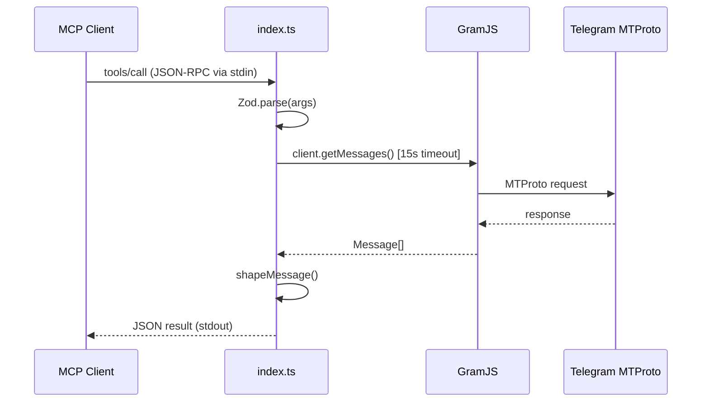
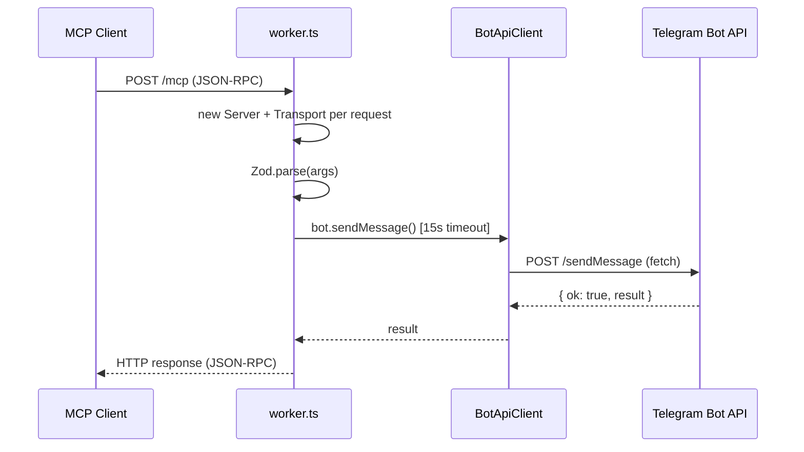
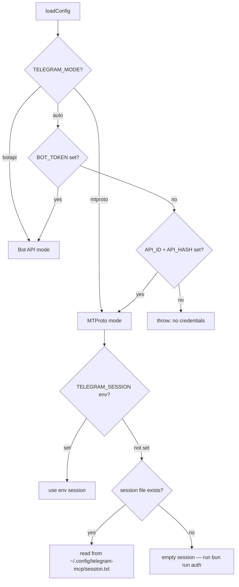

# Architecture — telegram-mcp

## Overview

telegram-mcp is a dual-mode MCP server for Telegram. It supports two independent transport layers and two Telegram access modes, selectable entirely via environment variables.

```
┌─────────────────────────────────────────────────────────┐
│                      MCP Client                         │
│         (Kiro, Claude Desktop, Cursor, etc.)            │
└────────────────────┬────────────────────────────────────┘
                     │
          ┌──────────┴──────────┐
          │                     │
    stdio transport       HTTP transport
    (local / Docker)      (Cloudflare Workers)
          │                     │
    src/index.ts          src/worker.ts
          │                     │
          └──────────┬──────────┘
                     │
          ┌──────────┴──────────┐
          │                     │
    MTProto mode          Bot API mode
    (GramJS)              (pure fetch)
          │                     │
   Telegram MTProto      Telegram Bot API
   Full access           Limited access
```

---

## Transport Modes

### stdio (default)

Used for local development, Docker, and `npx`. The MCP client spawns the server as a subprocess and communicates via stdin/stdout JSON-RPC.

```
MCP Client → spawn → src/index.ts → StdioServerTransport
```

Entry point: `src/index.ts`  
Start: `bun run src/index.ts`

### HTTP (Cloudflare Workers)

Used for edge deployment. The MCP client connects via HTTP POST to `/mcp`. Each request is stateless — a new server instance is created per request.

```
MCP Client → POST /mcp → src/worker.ts → WebStandardStreamableHTTPServerTransport
```

Entry point: `src/worker.ts`  
Deploy: `wrangler deploy`

---

## Telegram Access Modes

### MTProto mode

Activated by: `TELEGRAM_API_ID` + `TELEGRAM_API_HASH`

Uses GramJS to connect directly to Telegram's MTProto protocol. Requires a one-time interactive authentication (`bun run auth`) that saves a session string.

- Full message history access
- Private groups and channels
- Forum topics
- Search within chats
- All 7 tools available

### Bot API mode

Activated by: `TELEGRAM_BOT_TOKEN`

Uses native `fetch()` to call the Telegram Bot API. Zero native dependencies — runs anywhere including Cloudflare Workers.

- Send messages and files
- Receive recent incoming updates (not full history)
- 3 tools available (stdio), 2 tools available (worker/edge)

---

## Source Structure

```
src/
├── schemas.ts   ← Zod schemas + shared TypeScript types (single source of truth)
├── config.ts    ← env detection, mode selection, session loading
├── botapi.ts    ← Bot API client (pure fetch, edge-compatible)
├── index.ts     ← stdio MCP server (MTProto + Bot API, 7 tools)
├── worker.ts    ← HTTP MCP server for CF Workers (Bot API only, 2 tools)
└── auth.ts      ← one-time MTProto authentication script
```

---

## Data Flow

### MTProto tool call (stdio)



### Bot API tool call (HTTP / Worker)



---

## Config & Session Resolution



---

## Tool Availability Matrix

| Tool | stdio MTProto | stdio Bot API | Worker (edge) |
|------|:---:|:---:|:---:|
| `telegram_get_messages` | ✅ full history | ✅ recent updates only | ✅ recent updates only |
| `telegram_send_message` | ✅ | ✅ | ✅ |
| `telegram_send_document` | ✅ | ✅ | ❌ no filesystem |
| `telegram_get_dialogs` | ✅ | ❌ | ❌ |
| `telegram_get_topics` | ✅ | ❌ | ❌ |
| `telegram_search_messages` | ✅ | ❌ | ❌ |
| `telegram_get_chat_info` | ✅ | ❌ | ❌ |

---

## Testing Architecture

```
bun test                     # unit tests — pre-commit (Husky)
bun run test:integration     # Docker Compose integration tests
```

```
docker-compose.test.yml
├── mock-botapi   ← fake Telegram Bot API (Hono, port 8080)
├── worker        ← src/worker.ts via Bun.serve (port 8787)
└── test-runner   ← tests/runner.ts
                     ├── spawns src/index.ts via stdio
                     ├── sends JSON-RPC, asserts responses
                     └── tests worker HTTP transport via fetch
```

Unit test files:

| File | What it tests |
|------|---------------|
| `tests/config.test.ts` | Mode detection, session priority, error cases |
| `tests/schemas.test.ts` | Zod validation for all tool inputs |
| `tests/botapi.test.ts` | BotApiClient HTTP calls, error handling, timeout |

---

## Deployment Targets

| Target | Entry point | Transport | Telegram mode |
|--------|-------------|-----------|---------------|
| Local dev | `src/index.ts` | stdio | MTProto or Bot API |
| Docker | `src/index.ts` | stdio | MTProto or Bot API |
| `npx telegram-mcp` | `bin/telegram-mcp.js` | stdio | MTProto or Bot API |
| Cloudflare Workers | `src/worker.ts` | HTTP | Bot API only |
