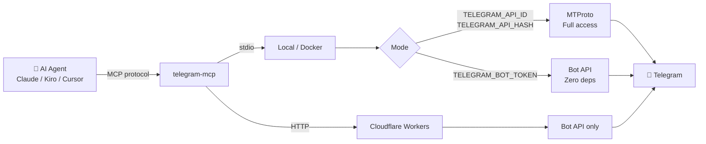
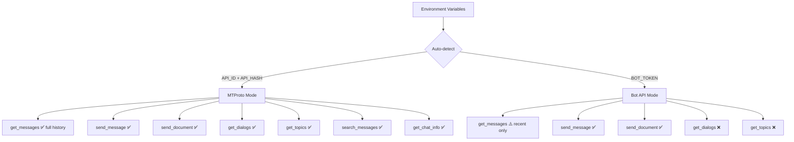
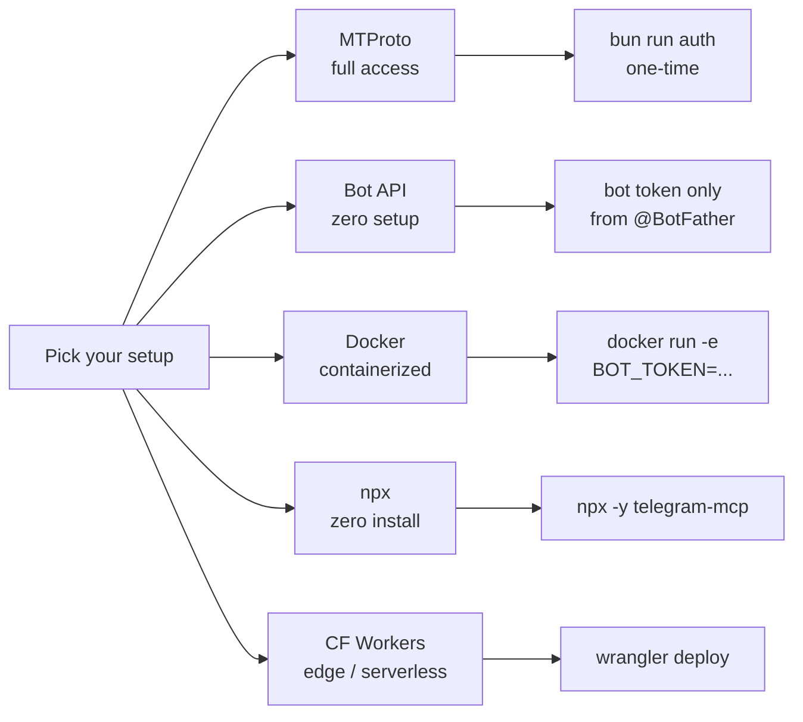

# telegram-mcp

> The last Telegram MCP server you'll ever need.  
> Simple enough for a weekend project. Powerful enough for production at scale.

[](https://github.com/sandikodev/telegram-mcp/actions)
[](https://bun.sh)
[](https://typescriptlang.org)
[](https://modelcontextprotocol.io)
[](LICENSE)

**Read this in other languages:**
[Bahasa Indonesia](docs/id/README.md) · [中文](docs/zh/README.md) · [日本語](docs/ja/README.md) · [العربية](docs/ar/README.md)

---

## The Problem

Every existing Telegram MCP server has the same limitations:

| | Python repos | Go repos | This project |
|--|--|--|--|
| Read full message history | ✅ | ✅ | ✅ |
| Forum topic support | ⚠️ | ⚠️ | ✅ |
| Env-based config | ❌ | ❌ | ✅ *(v1.1)* |
| Docker / edge-ready | ❌ | ❌ | ✅ *(v2)* |
| Native Bun/TypeScript | ❌ | ❌ | ✅ |
| Bot API mode (zero deps) | ❌ | ❌ | ✅ *(v2)* |
| Single binary / `npx` | ❌ | ❌ | ✅ *(v2)* |

**telegram-mcp** is built on Bun — the only runtime that is simultaneously fast enough for edge, native enough for TypeScript, and simple enough for a one-liner setup.

---

## What Can You Build With This?

```
AI agent + telegram-mcp + [any other MCP server]
```

**Operations & DevOps**
> *"Alert me on Telegram when CPU > 90% and include the last 10 error logs"*

**Finance & Trading** *(coming in v2 with edge deployment)*
> *"Watch BTC/USDT every 30 seconds and send a signal to the Trading group when RSI < 30"*

**Education & Library** *(our own use case)*
> *"Generate a weekly overdue report and send it to the Librarian group, topic Data Reports"*

**Business & E-commerce**
> *"Notify the Sales group every time a new order comes in with order details"*

**The pattern is always the same:** connect telegram-mcp to any data source MCP, and your AI agent becomes a real-time Telegram operator.

---

## How It Works



---

## Dual Mode



---

## Tools

| Tool | Description | MTProto | Bot API | Edge |
|------|-------------|:-------:|:-------:|:----:|
| `telegram_get_messages` | Read message history / recent updates | ✅ | ✅ | ✅ |
| `telegram_send_message` | Send Markdown/HTML messages to any chat or topic | ✅ | ✅ | ✅ |
| `telegram_send_document` | Send local files to any chat or topic | ✅ | ✅ | ❌ |
| `telegram_get_dialogs` | List all chats, groups, and channels | ✅ | ❌ | ❌ |
| `telegram_get_topics` | List forum topics in a supergroup | ✅ | ❌ | ❌ |
| `telegram_search_messages` | Search messages by keyword in a chat | ✅ | ❌ | ❌ |
| `telegram_get_chat_info` | Get metadata of a chat, group, or channel | ✅ | ❌ | ❌ |

> See [ARCHITECTURE.md](ARCHITECTURE.md) for the full tool availability matrix and system diagrams.

---

## Requirements

| Component | Minimum | Required for |
|-----------|---------|-------------|
| [Bun](https://bun.sh) | 1.0 | All modes |
| Telegram account | — | MTProto mode |
| `api_id` + `api_hash` | from [my.telegram.org](https://my.telegram.org) | MTProto mode |
| Bot token | from [@BotFather](https://t.me/BotFather) | Bot API mode |

---

## Quick Start



### Option A — MTProto mode (full access)

```bash
git clone https://github.com/sandikodev/telegram-mcp.git
cd telegram-mcp
bun install
bun run auth        # one-time: saves session to ~/.config/telegram-mcp/session.txt
```

Configure your MCP client:

```json
{
  "mcpServers": {
    "telegram": {
      "command": "bun",
      "args": ["run", "/path/to/telegram-mcp/src/index.ts"],
      "env": {
        "TELEGRAM_API_ID": "your_api_id",
        "TELEGRAM_API_HASH": "your_api_hash"
      }
    }
  }
}
```

### Option B — Bot API mode (zero setup)

No auth script needed. Just a bot token from [@BotFather](https://t.me/BotFather).

```json
{
  "mcpServers": {
    "telegram": {
      "command": "bun",
      "args": ["run", "/path/to/telegram-mcp/src/index.ts"],
      "env": {
        "TELEGRAM_BOT_TOKEN": "your_bot_token"
      }
    }
  }
}
```

### Option C — Docker

```bash
# Bot API mode
docker run -e TELEGRAM_BOT_TOKEN=your_token sandikodev/telegram-mcp

# MTProto mode
docker run \
  -e TELEGRAM_API_ID=your_id \
  -e TELEGRAM_API_HASH=your_hash \
  -e TELEGRAM_SESSION=your_session_string \
  sandikodev/telegram-mcp
```

### Option D — npx (zero install)

```json
{
  "mcpServers": {
    "telegram": {
      "command": "npx",
      "args": ["-y", "telegram-mcp"],
      "env": { "TELEGRAM_BOT_TOKEN": "your_bot_token" }
    }
  }
}
```

### Option E — Cloudflare Workers (edge)

```bash
cd telegram-mcp
wrangler secret put TELEGRAM_BOT_TOKEN
wrangler deploy
```

Then configure your MCP client with the HTTP URL:

```json
{
  "mcpServers": {
    "telegram": {
      "url": "https://telegram-mcp.your-subdomain.workers.dev/mcp"
    }
  }
}
```

> **Supported clients:** Kiro CLI, Claude Desktop, Cursor, Windsurf, and any MCP-compatible client.

---

## Usage Examples

Once connected to your MCP client:

- *"Read the last 20 messages from my team group"*
- *"Send a daily report to the Operations channel, topic Monitoring"*
- *"List all my Telegram groups and their IDs"*
- *"What topics are available in the Library group?"*
- *"Send this CSV file to the Data Reports topic"*

---

## Why Bun?

- **~10ms startup** — critical for MCP stdio transport
- **Native TypeScript** — no build step, no transpilation
- **Web APIs built-in** — `fetch`, `WebSocket`, `crypto` — edge-compatible
- **Single binary** — `bun build --compile` → zero-dependency executable *(v2)*
- **One language** — same code runs locally, in Docker, and on edge

---

## Security

- Session string stored locally at `~/.config/telegram-mcp/session.txt`
- **Never commit** your session file or `api_hash`
- `.gitignore` excludes session files by default
- Consider using a dedicated Telegram account for automation
- See [SECURITY.md](SECURITY.md) for the full security policy

---

## Documentation

| Document | Description |
|----------|-------------|
| [ARCHITECTURE.md](ARCHITECTURE.md) | System diagrams, data flow, transport modes, tool matrix |
| [ROADMAP.md](ROADMAP.md) | Vision, use cases, design principles |
| [CONTRIBUTING.md](CONTRIBUTING.md) | How to contribute — setup, conventions, adding tools, translations |
| [DISTRIBUTION.md](DISTRIBUTION.md) | How to list your MCP server on awesome lists |
| [CHANGELOG.md](CHANGELOG.md) | Version history |
| [SECURITY.md](SECURITY.md) | Security policy and vulnerability reporting |
| [CODE_OF_CONDUCT.md](CODE_OF_CONDUCT.md) | Community standards |

---

## Contributing

All contributions are welcome — new tools, bug fixes, documentation, translations, Docker support, edge adapters.

See [CONTRIBUTING.md](CONTRIBUTING.md) to get started.  
See [ROADMAP.md](ROADMAP.md) to understand where we're going.

> **Translators:** Add your language to `docs/<lang>/README.md` and open a PR.  
> Current translations: [id](docs/id/README.md) · [zh](docs/zh/README.md) · [ja](docs/ja/README.md) · [ar](docs/ar/README.md)

---

## License

MIT — see [LICENSE](LICENSE)
